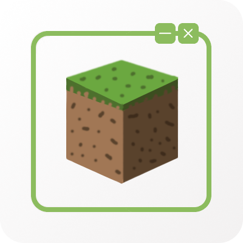

> [!CAUTION]
> This is **NOT** the mod you want!
>
> Check out [Cubes Without Borders](https://github.com/Kir-Antipov/cubes-without-borders) instead!

# Cubes With Borders

[](https://github.com/Kir-Antipov/cubes-with-borders/actions/workflows/build-artifacts.yml)
[](https://github.com/Kir-Antipov/cubes-with-borders/releases/latest)
[](https://modrinth.com/mod/cubes-with-borders)
[](https://www.curseforge.com/minecraft/mc-mods/cubes-with-borders)
[](https://github.com/Kir-Antipov/cubes-with-borders/blob/HEAD/LICENSE.md)



So, you know all those mods that advertise themselves as being able to turn Minecraft's fullscreen mode into a borderless fullscreen one? Well, here's some news - that's false advertising. What you actually get is regular exclusive fullscreen mode, which Minecraft already uses, with a single tweak: the game window doesn't minimize whenever it loses focus. Since the game stays in exclusive fullscreen mode, you will experience flickering whenever it loses or gains focus, and you won't be able to open other apps and overlays on top of it. In other words, you are not actually gaining any benefits of borderless fullscreen mode.

I have a mod that implements borderless fullscreen mode properly - [Cubes Without Borders](https://github.com/Kir-Antipov/cubes-without-borders). This is most likely what you are looking for. However, if you are obsessed with the idea of exclusive fullscreen and just wish that it wouldn't automatically minimize when it loses focus, then this abomination of a mod is for you.

This mod is the same as most "borderless fullscreen" mods on the market, minus the misleading advertisement and the bloat. Other mods tend to overcomplicate a very simple goal they achieve in the end, making them sensitive to Minecraft updates. On the contrary, this mod effectively consists of a single line of code, making it almost unbreakable. It's a "forever mod" - it supports every Minecraft version ever released *(well, at least the ones supported by Fabric)*, and it will likely support every Minecraft version yet to be released in the future. So, even if I haven't touched the code for 10 years, just know that the mod still works and hasn't been updated simply because it doesn't need to be updated, as it's feature-complete.

As for modpack authors, I sincerely ask you not to include this mod in any modpacks, as it is not suitable for the general audience. You are much better off with [Cubes Without Borders](https://github.com/Kir-Antipov/cubes-without-borders), which properly implements borderless fullscreen for Minecraft.

----

## Installation

Requirements:

 - Minecraft `>=1.14.3`
 - Fabric Loader `>=0.7.0`

You can download the mod from:

 - [GitHub Releases](https://github.com/Kir-Antipov/cubes-with-borders/releases/latest)
 - [Modrinth](https://modrinth.com/mod/cubes-with-borders)
 - [CurseForge](https://www.curseforge.com/minecraft/mc-mods/cubes-with-borders)
 - [GitHub Actions](https://github.com/Kir-Antipov/cubes-with-borders/actions/workflows/build-artifacts.yml) *(these builds may be unstable, but they represent the actual state of the development)*

----

## Build

Requirements:

 - JDK `8`

```bash
git clone https://github.com/Kir-Antipov/cubes-with-borders
cd cubes-with-borders

./gradlew build
cd build/libs
```

----

## License

Licensed under the terms of the [MIT License](LICENSE.md).
